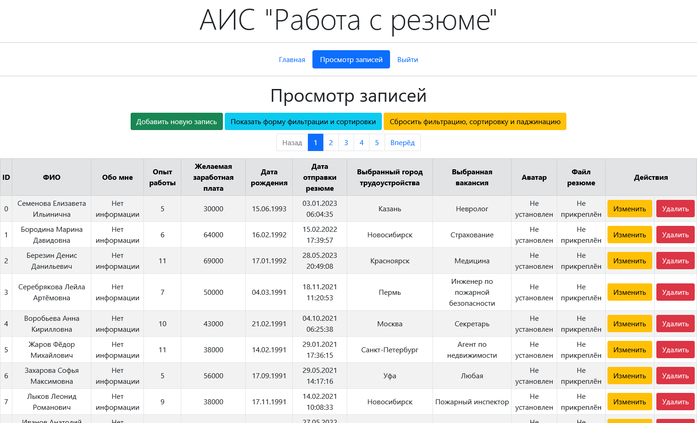

# АИС "Работа с резюме"

Небольшой проект для изучения PHP-фреймворка Symfony.

Позволяет вести БД с резюме - добавлять, изменять, удалять и фильтровать.



## Используемые технологии

- _**Docker-Compose v.3.9**_;
- _**Docker-Compose v.3.9**_;
- _**PHP v.8.1.21**_;
- _**Symfony v.5.3.6**_;
- _**Xdebug v.3.2.2**_;
- _**Composer v.2.5.8**_;
- _**Nginx v.1.23.1**_;
- _**PostgreSQL v.14.4**_;
- _**pgAdmin4 v.6.12**_;
- _**Bootstrap v.5.0.2**_.

## Необходимые компоненты

- Docker (используется Docker-Compose).

## Установка

1. Склонировать репозиторий;
2. Запустить терминал в корне проекта;
3. Добавить shell-команды командой:

   ```bash
   . commands-prod.sh
   ```

4. Собрать проект командой:

   ```bash
   n2038 build project
   ```

## Запуск

1. Запустить проект командой:

   ```bash
   n2038 up
   ```

2. Создать таблицы в БД командой (только при первом запуске):

   ```bash
   n2038 tables create
   ```

3. Заполнить таблицы в БД командой (только при первом запуске):

   ```bash
   n2038 tables seed
   ```

4. Система будет доступна по адресу:

   <http://localhost:80/>

   PGadmin будет доступен по адресу (запускается спустя некоторое время после запуска PHP):

   <http://localhost:8080/>

## Немного о структуре

- В корне проекта расположен сам проект Symfony со всеми файлами. `Dockerfile` для PHP и `docker-compose.yml` также расположены тут.
- В папке `nginx` расположен файл конфигурации для Nginx.
- В папке `postgres` расположен `Dockerfile` для PostgreSQL, а также SQL-скрипты (в папке `sql`).
- Конфигурационные ini-файлы для PHP я расположил в папке `./config/ini`.

## Краткое описание

1. На главной странице ничего примечательного не отображается. Неавторизованным пользователям доступны страницы для авторизации и регистрации.
2. В БД по умолчанию присутствуют записи двух пользователей:

    - `admin` (имеет все роли);
    - `user` (не имеет ролей).

   Пароль от обоих учётных записей: `password`.

3. После регистрации идёт перенаправление на форму авторизации (я ещё не разобрался как сделать автоматический вход после неё).
4. После авторизации пользователь попадает снова на главную страницу. В меню теперь доступны страница просмотра записей (при наличии соответствующей роли) и страница выхода из аккаунта.
5. На странице просмотра записей, помимо самой таблицы, присутствует кнопка для добавления записи, а также кнопки для фильтрации и сортировки. Присутствует панель паджинации сверху и снизу таблицы.
6. Для каждой записи в таблице есть также кнопки для изменения и удаления. Они доступны только если пользователь имеет соответствующие роли.
7. Все поля в таблице отображаются стандартно, за исключением аватара, который отображается как картинка, и файла, для которого отображается кнопка для скачивания.

## PGadmin

1. Авторизация в PGadmin:

   - `Username`: `admin@mail.com`;
   - `Password`: `password`.

2. При работе в PGadmin, добавить сервер необходимо с настройками:

   - `Host`: `postgres`;
   - `Port`: `5432`;
   - `Username`: `admin`;
   - `Password`: `password`.

## Остановка

- Остановить проект командой:

   ```bash
   n2038 down
   ```

## Смена окружения

- По умолчанию используется окружение Production. Для смены на Development используется команда (необходимо остановить контейнеры):

   ```bash
   n2038 set stopped dev
   ```

- Для смены на Production используется аналогичная команда:

   ```bash
   n2038 set stopped prod
   ```

## Удаление

1. Очистить проект командой:

   ```bash
   n2038 clear project
   ```

2. Конфигурация проекта использует образы: _**nginx:1.23.1**_ и _**dpage/pgadmin4:6.12**_.
   
   Если они больше нигде не используются, то и их удалить соответствующими командами:

   ```bash
   docker rmi nginx:1.23.1
   docker rmi dpage/pgadmin4:6.12
   ```
